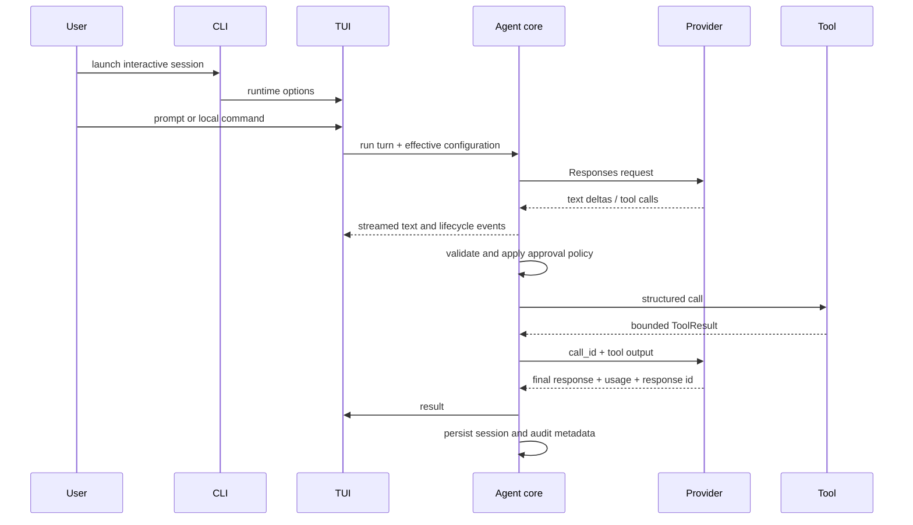

# CodeFarmer Architecture

## Design goals

CodeFarmer is a workspace-scoped coding agent delivered as a portable Node.js
CLI. Its core is independent of the OpenAI SDK, tools are explicit and
validated, mutations are auditable and reversible when the workspace has not
changed, and interactive and non-interactive use share the same runtime.

TypeScript and Node.js 22+ were selected for their mature OpenAI streaming
support, strong runtime/process APIs across Windows, macOS, and Linux, and
straightforward npm distribution. TypeScript also gives tool schemas, provider
events, sessions, and configuration one checked contract.

## Modules

```text
src/
├─ cli/        Commander entrypoint, script commands, and legacy rendering
├─ tui/        Ink full-screen application, transcript, input, and overlays
├─ core/       Agent loop, prompts, sessions, approvals, and undo transactions
├─ providers/  Provider-neutral contract and OpenAI Responses implementation
├─ tools/      Workspace files, search, patches, processes, and read-only Git
└─ infra/      Configuration, paths, persistence, logging, and typed errors
```

- **CLI** translates arguments and script-oriented commands into core operations.
  Interactive TTY invocations dynamically load the TUI; machine-readable
  `run --json` output is kept separate from diagnostics on stderr.
- **TUI** owns terminal layout and input state. It consumes provider and tool
  lifecycle events, renders the transcript and approval modal, and dispatches
  local commands such as status, diff, session switching, and undo. It never
  parses human-readable stdout to infer agent state.
- **Core** owns the model/tool loop and policy. It is the only layer that
  coordinates provider calls, approvals, tool scheduling, session history,
  and mutation transactions.
- **Providers** implement `AgentProvider`. SDK-specific response objects are
  normalized into text deltas, tool calls, token usage, completion, and error
  events before they reach the core.
- **Tools** receive validated structured arguments and a workspace context.
  Reads may run concurrently; commands and file mutations run serially.
- **Infrastructure** resolves layered configuration and platform directories,
  performs atomic persistence, produces redacted JSONL logs, and maps internal
  failures to stable CLI errors and exit codes.

The main public contracts are `AgentProvider`, `ProviderEvent`,
`ToolDefinition`, `ToolResult`, `ToolLifecycleHooks`, `ApprovalPolicy`,
`SessionRecord`, `MutationTransaction`, and `CodeFarmerConfig`.

## Request lifecycle



The OpenAI provider uses the Responses API with `store: true` by default.
Subsequent turns pass `previous_response_id`, which preserves server-side
reasoning state without coupling the core to OpenAI response types. The loop
stops after `maxAgentTurns` (25 by default). Invalid tool parameters are
returned as structured tool errors instead of terminating the process.

`baseURL` is resolved through the normal CLI/environment/project/user/default
configuration precedence and passed to the OpenAI SDK constructor. Sessions
persist that normalized URL so a stored `previous_response_id` cannot be
silently resumed against another endpoint.

## File mutation and undo

`apply_patch` operates on one UTF-8 file per call. The request carries a
workspace-relative path, unified diff, and expected SHA-256 baseline. The tool
validates containment, ignore and size policy, and the baseline hash before it
applies the patch in memory. It then commits through a temporary file and
atomic rename.

Each successful mutation records before/after hashes and enough snapshot data
to restore the prior state. `undo` restores only when the current file still
matches the transaction's after-hash; this prevents overwriting edits made by
the user or another process. External effects of `run_command` are not
transactional and cannot be undone by CodeFarmer.

## Configuration and persistence

Effective configuration is resolved in this order, from highest to lowest:

1. CLI flags
2. `CODEFARMER_*` environment variables
3. workspace `codefarmer.config.json`
4. user `codefarmer.config.json`
5. built-in defaults

`OPENAI_API_KEY` is read directly from the process environment and is never a
configuration property. Platform paths come from `env-paths` with the
unsuffixed application name `codefarmer`: user configuration lives in its
config directory, sessions and transactions under its data directory, and
daily JSONL files in its log directory. Workspace-specific records are keyed
by a hash of the canonical workspace path.

## Reliability boundaries

- Provider requests retry transient network, HTTP 429, and 5xx failures up to
  two times.
- Tool output, file input, command duration, and loop turns have hard limits.
- Ctrl+C or Escape cancels the active request or tool and persists session
  state. Ctrl+C exits when no turn is active.
- Exit codes distinguish general failures (`1`), argument/configuration errors
  (`2`), approval failures (`3`), authentication (`4`), and interruption
  (`130`).
- CodeFarmer provides application-level validation and approval, not an OS
  process sandbox. See [SECURITY.md](SECURITY.md) for the trust boundary.
