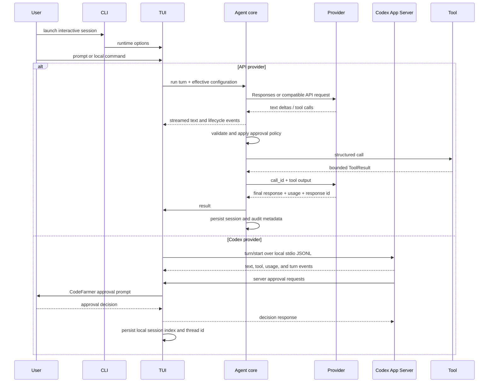

# CodeFarmer Architecture

## Design goals

CodeFarmer is a workspace-scoped coding agent delivered as a portable Node.js
CLI. Its core is independent of the OpenAI SDK, tools are explicit and
validated, mutations are auditable and reversible when the workspace has not
changed, and interactive and non-interactive use share the same runtime.

TypeScript and Node.js 22+ were selected for their mature OpenAI streaming
support, strong runtime/process APIs across Windows, macOS, and Linux, and
straightforward npm distribution. TypeScript also gives tool schemas, provider
events, sessions, and configuration one checked contract.

## Modules

```text
src/
├─ cli/        Commander entrypoint, script commands, and legacy rendering
├─ tui/        Ink full-screen application, transcript, input, and overlays
├─ core/       Agent loop, prompts, sessions, approvals, and undo transactions
├─ providers/  API providers and the Codex App Server runtime adapter
├─ tools/      Workspace files, search, patches, processes, and read-only Git
└─ infra/      Configuration, paths, persistence, logging, and typed errors
```

- **CLI** translates arguments and script-oriented commands into core operations.
  Interactive TTY invocations dynamically load the TUI; machine-readable
  `run --json` output is kept separate from diagnostics on stderr.
  `stats` is a pure offline aggregation of local session records — it never
  contacts the network — and labels its cost figures as estimates based on
  public list prices, with unmatched models listed separately.
- **TUI** owns terminal layout and input state. It consumes provider and tool
  lifecycle events, renders the transcript and approval modal, and dispatches
  local commands such as status, diff, session switching, and undo. It never
  parses human-readable stdout to infer agent state.
- **Core** owns the API-provider model/tool loop and policy. It coordinates
  provider calls, approvals, tool scheduling, session history, and mutation
  transactions.
- **Providers** implement `AgentProvider` for API-backed model calls. Codex is
  a separate `RuntimeRunner` adapter over Codex App Server: the server owns its
  model/tool loop and thread, while CodeFarmer streams its events, mirrors a
  local session index, and bridges approval requests.
- **Tools** receive validated structured arguments and a workspace context.
  Reads may run concurrently; commands and file mutations run serially.
- **Infrastructure** resolves layered configuration and platform directories,
  performs atomic persistence, produces redacted JSONL logs, and maps internal
  failures to stable CLI errors and exit codes.

The main public contracts are `AgentProvider`, `ProviderEvent`,
`ToolDefinition`, `ToolResult`, `ToolLifecycleHooks`, `ApprovalPolicy`,
`SessionRecord`, `MutationTransaction`, and `CodeFarmerConfig`.

## Request lifecycle


```mermaid
sequenceDiagram
    participant User
    participant CLI
    participant TUI
    participant Core as Agent core
    participant Provider
    participant AppServer as Codex App Server
    participant Tool
    User->>CLI: launch interactive session
    CLI->>TUI: runtime options
    User->>TUI: prompt or local command
    alt API provider
    TUI->>Core: run turn + effective configuration
    Core->>Provider: Responses or compatible API request
    Provider-->>Core: text deltas / tool calls
    Core-->>TUI: streamed text and lifecycle events
    Core->>Core: validate and apply approval policy
    Core->>Tool: structured call
    Tool-->>Core: bounded ToolResult
    Core->>Provider: call_id + tool output
    Provider-->>Core: final response + usage + response id
    Core->>TUI: result
    Core->>Core: persist session and audit metadata
    else Codex provider
    TUI->>AppServer: turn/start over local stdio JSONL
    AppServer-->>TUI: text, tool, usage, and turn events
    AppServer->>TUI: server approval requests
    TUI->>User: CodeFarmer approval prompt
    User-->>TUI: approval decision
    TUI-->>AppServer: decision response
    TUI->>TUI: persist local session index and thread id
    end
```

The OpenAI API provider uses the Responses API with `store: true` by default.
Subsequent turns pass `previous_response_id`, which preserves server-side
reasoning state without coupling the core to OpenAI response types. The loop
stops after `maxAgentTurns` (12 by default), then makes at most one tool-free
summary request. Reasoning defaults to `high`; the remaining defaults favor
efficiency: low text verbosity, no visible reasoning summary, a 2,048-token
completion limit per request, and a 24,000-character combined tool output budget per request. Invalid tool parameters are returned as structured
tool errors instead of terminating the process.

`baseURL` is resolved through the normal CLI/environment/project/user/default
configuration precedence and passed to the OpenAI SDK constructor. Sessions
persist that normalized URL so a stored `previous_response_id` cannot be
silently resumed against another endpoint.

Codex App Server uses its own thread history and compaction. CodeFarmer persists
the App Server thread ID alongside its local session record; Codex-native file
changes do not create CodeFarmer patch transactions and therefore are not
reverted by `undo`.

## Session orchestration

API-provider interactive turns are owned by `SessionOrchestrator`, which wraps
`AgentRunner`. It serializes one session's work, accepts follow-up prompts while
the active turn is running, and emits a provider-neutral event stream for the
TUI, CLI renderers, logs, and integrations. The pending queue is bounded to
eight prompts. TUI-submitted turns are saved with the session; completed turns
remain in the normal `SessionRecord` history.

Queued TUI turns and todo items are saved with the session. A restored queue stays paused until
`/queue continue`; an unfinished active turn becomes an interruption notice instead of being
replayed. The orchestrator also exposes process-local `AgentHooks` for before/after turn
and tool integrations. Hooks are observers or explicit veto points inside the
runtime; CodeFarmer never executes arbitrary workspace hook scripts implicitly.
Codex App Server currently runs one turn at a time and does not use this queue.

## Layered permissions

Approval still starts from `ask`, `auto`, or `read-only`. An interactive
approval can additionally grant access once, for the current session, or for
the current workspace. Session grants are memory-only. Workspace grants are
stored under the user data directory and keyed by the canonical workspace
hash. File grants match the selected relative directory; command grants match
the executable and argument prefix. Hard-deny checks and explicit `git push`
confirmation always run before these grants.

## File mutation and undo

`apply_patch` operates on one UTF-8 file per call, or on a batch of files
through the `files` array. Every entry carries a workspace-relative path,
unified diff, and expected SHA-256 baseline. The tool validates containment,
ignore and size policy, and the baseline hash before it applies the patch in
memory. A batch validates every entry before anything is written (all-or-
nothing), asks for approval once, and rolls back already-written files if a
later one fails mid-commit. Each file commits through a temporary file and
atomic rename.

Each successful mutation records before/after hashes and enough snapshot data
to restore the prior state. `undo` restores only when the current file still
matches the transaction's after-hash; this prevents overwriting edits made by
the user or another process. External effects of `run_command` are not
transactional and cannot be undone by CodeFarmer.

## Configuration and persistence

Effective configuration is resolved in this order, from highest to lowest:

1. CLI flags
2. `CODEFARMER_*` environment variables
3. per-workspace config in the platform user configuration directory
4. user `codefarmer.config.json`
5. built-in defaults

`OPENAI_API_KEY` is read directly from the process environment and is never a
configuration property. Platform paths come from `env-paths` with the
unsuffixed application name `codefarmer`: user and per-workspace configuration
live in its config directory, sessions and transactions under its data
directory, and daily JSONL files in its log directory. Workspace-specific
files are keyed by a hash of the canonical workspace path. A legacy
`codefarmer.config.json` at the workspace root is read as a fallback for
backward compatibility; new writes go to the user config directory.

## Skills

The runtime discovers Codex-compatible `SKILL.md` directories from workspace ancestors,
user/system locations, and compatible Codex locations. The initial provider instruction carries a
bounded catalog of references, descriptions, and paths; the agent uses read-only `read_skill` and
`read_skill_resource` tools to load selected instructions and text resources progressively. Explicit
CLI/TUI selections are passed only to the active run or TUI session and are not persisted in a
`SessionRecord`. Resources are resolved through their skill directory's real path, preventing
traversal and symlink escapes. Skills never execute scripts implicitly.

## Reliability boundaries

- Provider requests retry transient network, HTTP 429, and 5xx failures up to
  two times.
- Tool output, file input, command duration, and loop turns have hard limits.
- Ctrl+C or Escape cancels the active request or tool and persists session
  state. Ctrl+C exits when no turn is active.
- Exit codes distinguish general failures (`1`), argument/configuration errors
  (`2`), approval failures (`3`), authentication (`4`), and interruption
  (`130`).
- CodeFarmer provides application-level validation and approval, not an OS
  process sandbox. See [SECURITY.md](SECURITY.md) for the trust boundary.
